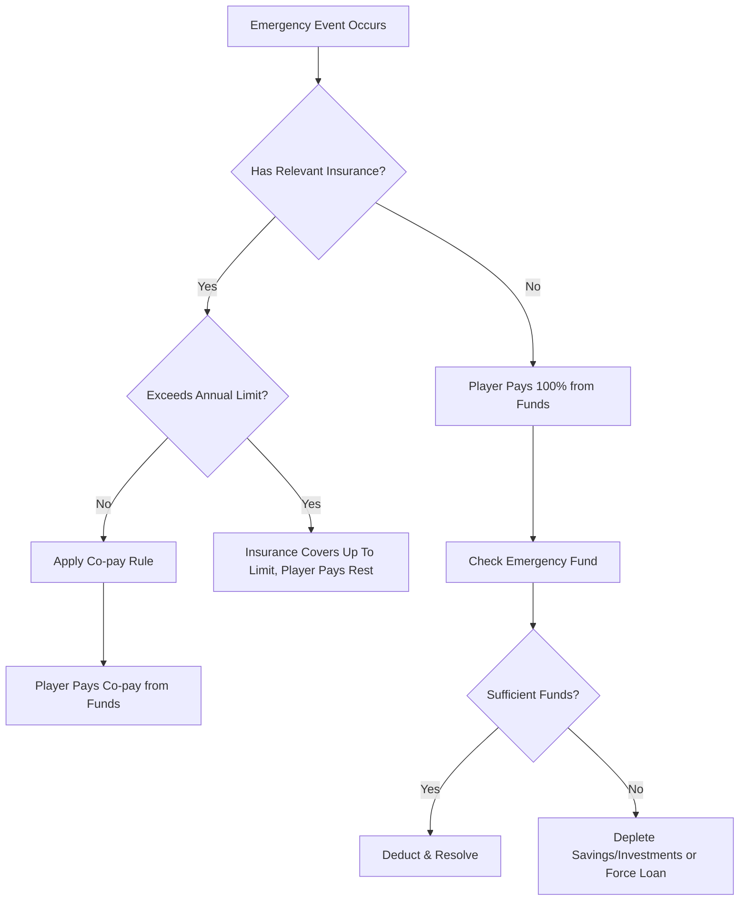

# Insurance & Protection System

## Overview
The Insurance System in the game is designed to teach players the importance of risk management. It handles various insurance types, their premium costs, coverage rules, and how they interact with life events like medical emergencies, accidents, or death (simulated as loan payoff).

## What Exists (✅)
- Insurance products: Term Insurance, Health Insurance, Vehicle Insurance.
- Premium and coverage defined in constants.
- Can buy insurance from InsuranceTab.
- Medical events check health insurance first in `eventResolver`.

## What's Missing & Needs Implementation (❌)

### 1. Mediclaim (Health Insurance) Flow
- **Event Handling:** When a medical event fires, check if the player has an active Mediclaim policy.
  - **Covered:** Mediclaim pays 90% of the cost. The player pays a 10% co-pay out of pocket.
  - **Uncovered:** The player pays 100% of the cost. Funds are drawn sequentially from: Emergency Fund -> Savings -> Liquid Investments.
- **Premium Rules:** Premium must be age-tiered. As the player gets older, the premium increases.
- **Coverage Limits:** There must be an annual cap (e.g., ₹5,00,000). If an event exceeds the cap, the excess is paid 100% by the player.

### 2. Term Insurance & Home Loan Linkage
- **Mandatory Link:** Term insurance is mandatory when a Home Loan is taken. The game must prompt/enforce the purchase of term insurance covering at least the outstanding loan amount.
- **Payoff Rule:** While death isn't simulated as game over, the principle of term insurance paying off the home loan must be modeled (e.g., if a specific trigger occurs or just enforced as a strict requirement at loan origination).
- **Retirement Check:** At the retirement date, the game must verify that any home loan taken was backed by term insurance throughout its tenure.

### 3. Vehicle Insurance
- **Requirement:** Automatically required or strongly prompted if the player owns a car.
- **Accident Event:** If a vehicle accident event occurs:
  - **Insured:** Player pays a small co-pay (e.g., 5-10% or fixed deductible).
  - **Uninsured:** Player pays 100% of the repair costs.

### 4. Emergency Fund Mechanics
- **Target Calculation:** 6 months of total mandatory expenses (Fixed Expenses + Utilities + EMIs + Insurance Premiums).
- **Storage:** Should be held in a Savings Account or Liquid Fund (lowest risk).
- **Depletion:** Automatically depletes when emergency events hit and insurance doesn't fully cover the cost.
- **Warnings:** The game should generate a warning notification if the Emergency Fund falls below 3 months of expenses.

### 5. Insurance Tab UI
- Must display:
  - Active policies.
  - Premiums currently being paid.
  - Coverage amounts.
  - Claim history (log of events covered).

## Data Models

```typescript
interface InsurancePolicy {
  id: string;
  type: 'TERM' | 'HEALTH' | 'VEHICLE';
  coverageAmount: number;
  premiumAmount: number; // Monthly or Annual
  premiumFrequency: 'MONTHLY' | 'ANNUALLY';
  isActive: boolean;
  linkedLoanId?: string; // For Term Insurance linked to Home Loan
}

interface InsuranceClaim {
  id: string;
  policyId: string;
  eventId: string;
  totalCost: number;
  amountCovered: number;
  copayAmount: number;
  dateClaimed: Date; // In-game date
}
```

## Claim Flow Diagram


## Acceptance Criteria
- [ ] Mediclaim correctly calculates 10% co-pay and tracks annual limits.
- [ ] Game blocks or warns heavily if Home Loan is taken without Term Insurance.
- [ ] Emergency Fund target dynamically updates as expenses/EMIs change.
- [ ] Warning fires when Emergency Fund is < 50% of target.
- [ ] Vehicle accident costs branch correctly based on insurance status.
