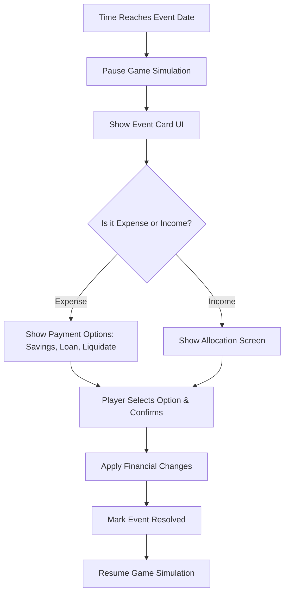

# Events System (Random + Fixed + Bonus)

## Overview
The Events System drives the narrative and financial challenges in the game. It mixes predictable milestone events (goals) with unpredictable life and market events to test the player's financial resilience and planning.

## What Exists (✅)
- Event types: JOB_LOSS, MEDICAL_EMERGENCY, RENOVATION, BONUS, WINDFALL, MARKET_CRASH, MARKET_BOOM.
- Pre-scheduled events across lifetime via `generateRandomEvents`.
- Basic frequency rules.
- `eventResolver` handles basic resolution.
- Cutscene animations and calendar queue.

## What's Missing & Needs Implementation (❌)

### 1. Fixed Goal Events (Milestones)
- **Mechanics:** These occur on EXACT predetermined dates set by the player during setup.
- **Types:** Marriage, Home Buying (Downpayment), Car Buying.
- **Resolution Options:**
  - Use funded bucket (ideal).
  - Take a loan to cover the shortfall.
  - Sell investments.
  - Postpone the event.
- **Postponement Penalty:** Selecting a new date adds 1-3 years, and the total cost increases due to inflation.

### 2. Random Emergency Events (Detailed Rules)
- **Job Loss:** Max 5 per game, min 5 years apart. Duration: 2-6 months.
  - **Effect:** Salary drops to 0. Other passive income continues. Player must live off Emergency Fund/Savings.
  - **Resolution:** After duration, re-employment triggers at same, slightly lower, or slightly higher salary.
- **Medical Emergency:** ~Once every 3 years. Checks Mediclaim (90/10 copay) vs out-of-pocket (100%).
- **Renovation:** Once every 1-2 years, ONLY if the player owns a home. Cost paid from savings.
- **Vehicle Accident:** Random, applies if player owns a car. Checks Vehicle Insurance.

### 3. Bonus Events
- **Company Bonus:** Once a year (if employed). Amount: 1-3 months of salary. Triggers an Allocation Screen.
- **Windfall:** Exactly ONCE per lifetime (e.g., inheritance). Amount: Large (5L-20L based on tier). Triggers Allocation Screen.

### 4. Event Response UI & Flow
- **Game Pause:** When an event fires, the simulation MUST PAUSE.
- **Event Card UI:**
  - Description of what happened.
  - Financial impact (Cost or Income).
  - Actionable buttons (Options).
- **Options for Expenses:**
  - Use Emergency Fund.
  - Use Goal Bucket.
  - Take Loan.
  - Sell Investments.
- **Options for Income:**
  - Allocate to goals.
  - Add to Emergency Fund.
  - Pay off Loan.

## Data Models

```typescript
type EventCategory = 'FIXED_GOAL' | 'EMERGENCY' | 'WINDFALL' | 'MARKET';

interface GameEvent {
  id: string;
  category: EventCategory;
  type: string; // e.g., 'JOB_LOSS', 'MARRIAGE'
  triggerDate: Date; // Game date
  title: string;
  description: string;
  financialImpact: number; // Positive for income, negative for cost
  resolved: boolean;
}
```

## Event Resolution Flow


## Acceptance Criteria
- [ ] Simulation pauses on event trigger and waits for user input.
- [ ] Fixed goals trigger exactly on their set dates with postponement options.
- [ ] Job Loss correctly halts salary for 2-6 months and resumes it afterward.
- [ ] Windfall triggers exactly once and provides a full allocation screen.
- [ ] Event frequency rules are strictly adhered to during generation.
