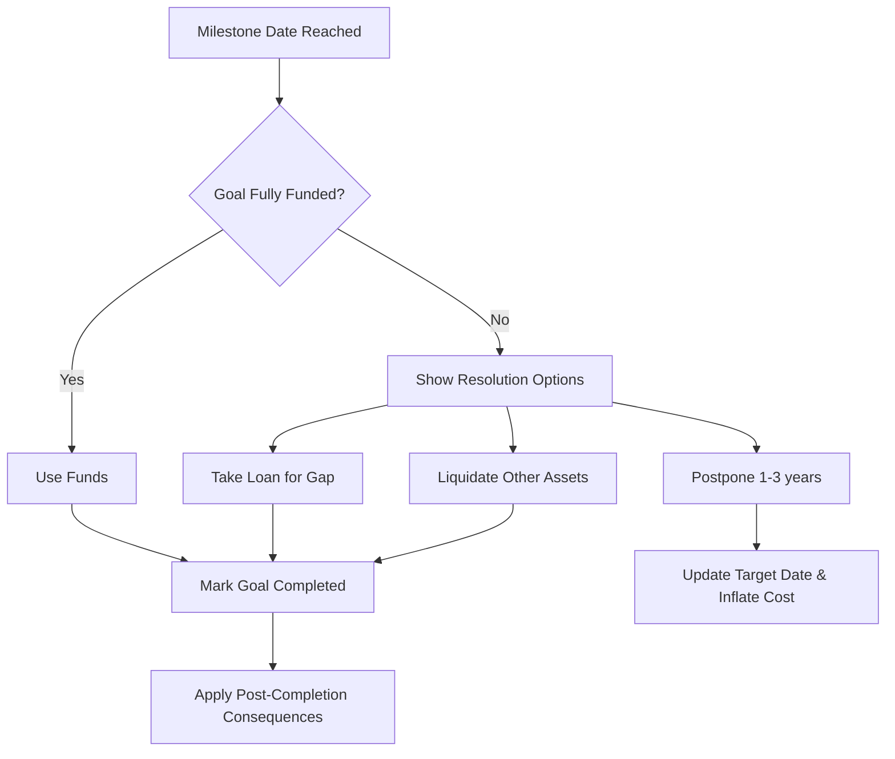

# Milestone Events & Goal Completion Flow

PARTIALLY IMPLEMENTED. MilestoneModal exists but needs expansion.

## What EXISTS (✅):
- MilestoneModal appears when goal target date is reached
- Options: Use Funds, Take Loan, Sell Investments, Postpone
- LiquidationModal for selling investments

## What's MISSING (❌ - write detailed spec):

### FIXED MILESTONE EVENTS:
Each goal has a FIXED date. When that date arrives, the game auto-pauses and shows the milestone screen:

1. **Marriage Milestone**:
   - Date: fixed at character age ~26-30
   - Amount: tier-based (T1: 15-25L, T2: 8-15L, T3: 5-10L)
   - If bucket is funded: "Congratulations! Use wedding fund" → money deducted, goal marked complete
   - If bucket is NOT fully funded: Options:
     a. Use what's available + take loan for remainder
     b. Sell from other goal investments to fill gap
     c. Postpone marriage by 1-3 years (new date set, cost inflates)
   - Post-marriage: KIDS_FUTURE goal unlocks, expenses may increase (spouse adds to household)

2. **Home Buying (Downpayment) Milestone**:
   - Date: fixed at age ~28-35
   - Downpayment amount: 20% of home price (tier-based)
   - If funded: pay downpayment, take home loan for 80% → new EMI starts
   - If not funded: same options as marriage
   - Post-purchase: rent expense stops (if was renting), home maintenance cost starts, home appreciates yearly
   - HOME LOAN must be covered by TERM INSURANCE

3. **Car Buying (Downpayment) Milestone**:
   - Date: fixed at age ~25-30
   - Downpayment: 20-30% of car price
   - If funded: pay downpayment, take car loan for remainder → new EMI
   - If not funded: same options
   - Post-purchase: car maintenance cost starts, vehicle insurance should be bought

4. **Vacation (Recurring)**:
   - Happens EVERY YEAR
   - Amount: tier-based (T1: 2-5L, T2: 1-3L, T3: 0.5-1.5L)
   - If funded: enjoy vacation, money deducted
   - If not: skip vacation this year (no penalty but missed experience), or take from savings, or take personal loan
   - Budget resets each year

5. **Business Capital**:
   - Date: player-chosen or fixed ~age 30-35
   - Amount: tier-based
   - If funded: start business, new income stream begins (variable monthly income)
   - If not: same options, or take business loan

6. **Kids Future (post-marriage only)**:
   - Unlocks after marriage milestone is complete
   - Date: fixed ~15-20 years after marriage (child's education)
   - Amount: large corpus (tier-based)
   - Long-term goal, usually equity/MF heavy

7. **Emergency Fund**:
   - No fixed date - always active
   - Target: 6 months of current expenses
   - Depletes when emergencies hit, needs to be refilled
   - Signal: green if ≥6 months, yellow if 3-6 months, red if <3 months

8. **Retirement Fund**:
   - Date: retirement age (user-selected, max 60)
   - Target: corpus to sustain at 4% annual withdrawal for 20 years post-retirement
   - Must be fully funded by retirement date
   - If not funded: score penalty, "insufficient retirement savings" warning

### POST-COMPLETION CONSEQUENCES:
- Marriage → increased monthly expenses, kids future goal unlocks
- Home → rent stops, maintenance starts, home loan EMI starts, asset appreciation
- Car → maintenance starts, car loan EMI, depreciation
- Business → new income stream, business risk events enabled
- Each consequence should update the financial model immediately

### Data model for MilestoneEvent
```typescript
interface MilestoneEvent {
  id: string;
  goalType: 'MARRIAGE' | 'HOME' | 'CAR' | 'VACATION' | 'BUSINESS' | 'KIDS_FUTURE' | 'RETIREMENT';
  targetDate: Date;
  targetAmount: number;
  currentFunding: number;
  isRecurring: boolean;
  status: 'PENDING' | 'COMPLETED' | 'POSTPONED' | 'MISSED';
  options: MilestoneOption[];
}

interface MilestoneOption {
  type: 'USE_FUNDS' | 'TAKE_LOAN' | 'LIQUIDATE_OTHER' | 'POSTPONE' | 'SKIP';
  description: string;
  consequences: Effect[];
}
```

### Flow diagrams for each milestone


### UI description for each milestone modal
- **Overlay**: Full screen dim, distinct modal popup.
- **Header**: Confetti or specific icon based on goal type. Title e.g. "It's Wedding Time!"
- **Body**: Shows `Target Amount` vs `Available Funds`.
- **Actions**:
  - Primary Button if funded: "Celebrate & Pay"
  - If gap exists: accordion or list of secondary options:
    - "Take Loan of ₹X (EMI: ₹Y/mo)"
    - "Sell other investments (Opens Liquidation UI)"
    - "Postpone by X years" (shows new inflated cost warning)
