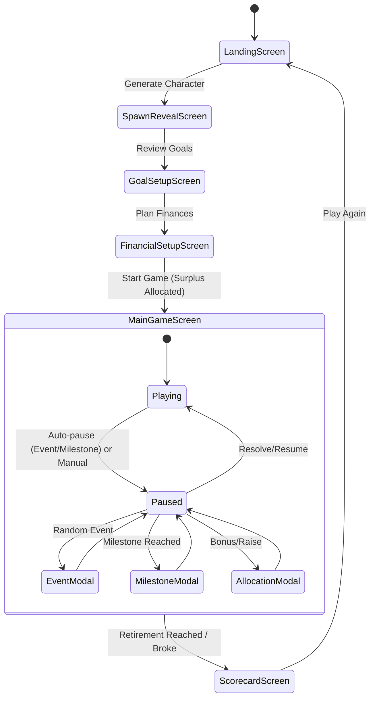

# Complete Game Flow & Screen Specifications

This is the MASTER FLOW document tying all specs together.

### SCREEN FLOW:
```
1. LANDING SCREEN
   → Input/generate seed
   → Select city tier (T1/T2/T3)
   → Select job field (Science/Arts/Commerce)
   → "Generate Character" button
   
2. SPAWN REVEAL SCREEN
   → Character profile card (animated reveal)
   → Name, age, city, job title, salary
   → Housing status (own/rent + amount)
   → Fixed expenses breakdown
   → Utility expenses breakdown
   → Outstanding loans (if any, with details)
   → Dependants (if any, with expense)
   → Extra income (side business, rent income)
   → Character's dreams/goals narrative text
   → "Continue to Goals" button

3. GOAL SETUP SCREEN
   → List of all goals (auto-generated based on character)
   → Each goal: name, target amount, target date
   → Goals include: Marriage, Home, Car, Vacation, Business, Kids Future (locked), Emergency Fund, Retirement
   → User reviews goals
   → "Continue to Financial Planning" button

4. FINANCIAL SETUP SCREEN (per-goal allocation)
   → Shows surplus amount (Income - Expenses)
   → For EACH goal (swipeable/tabbed):
     - Goal name & target
     - Monthly allocation input (₹ amount)
     - Investment instrument selector (Equity/MF/FD/Gold/Silver/Savings)
     - Projected growth visualization
     - Red/Yellow/Green signal: will this amount + instrument reach the goal on time?
   → Bottom bar: total allocated vs surplus, remaining unallocated
   → Can go back/forth between goals
   → "Start Game" button (only when fully allocated or user confirms partial allocation)

5. MAIN GAME SCREEN
   → Top: Timeline bar (current age, months, progress to retirement)
   → Center: Growth chart showing all goals' progress over time
   → Income/expense ticker
   → Pause/Play/Speed controls
   → Bottom tabs: Income, Loans, Investments, Goals, Insurance, Bank
   → Events auto-pause the game and show event cards
   → Milestone modals at goal dates
   → Allocation screens for bonuses/raises
   → Income growth options (courses, jobs, business)

6. SCORECARD SCREEN
   → Final score and grade
   → Detailed breakdown
   → Per-goal results
   → Best/worst decisions
   → Net worth summary
   → Play again / Share
```

### STATE MACHINE:


### PAUSE STATES:
While paused, the player can:
- Switch tabs (Income, Loans, Investments, Goals, Insurance, Bank).
- Adjust SIPs/Monthly allocations.
- Buy/sell investments manually.
- Prepay loans.
- Buy insurance.
- (If paused by an Event/Milestone, a modal is open; the player must resolve the modal to unpause, but can view background info).

### GAME SPEED:
- 1x: 1 month per 2 seconds
- 2x: 1 month per 1 second  
- 5x: 1 month per 0.4 seconds
- Auto-pause on events, milestones, raises

### Data flow between screens
- `LandingScreen` sets base configs (seed, tier, job) and sends them to store.
- `SpawnRevealScreen` consumes store generator to build and display `CharacterState` and `GameState`.
- `GoalSetupScreen` triggers goal generation based on `CharacterState` and displays `GoalList`.
- `FinancialSetupScreen` collects user input to modify monthly allocations within `GameState`. Validation gates progression.
- `MainGameScreen` runs the primary simulation loop consuming `GameState`, triggering events, and updating `ScoreState`.
- `ScorecardScreen` consumes `ScoreState` upon game end event to calculate and display final metrics.
